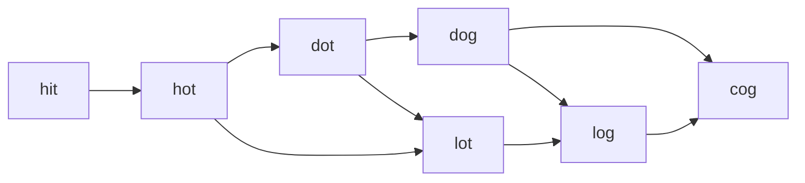

# Graph

## Concepts <a href="#concepts" id="concepts"></a>

| Concepts                      | Description                                                                                                                                                                                                                                                           |
| ----------------------------- | --------------------------------------------------------------------------------------------------------------------------------------------------------------------------------------------------------------------------------------------------------------------- |
| Walk                          | A walk is a sequence of nodes such that each successive node is adjacent to the previous one.  The length of walk is the numbers of edges.                                                                                                                            |
| Path                          | a sequence of vertices v1, v2, …, vk, it have an edge b/w vi\~vj. A path is _simple_ if its vertices are all different. 两点之间可能有多条path. A path is a walk in which no node may be used more than once. The shortest path length from u to v, is the distance of u to v. |
| Trail                         | A trail is a walk in which no edge may be used more than once.                                                                                                                                                                                                        |
| Cycle                         | A Cycle is a path that starts and ends at the same vertex and include at least one vertex.                                                                                                                                                                            |
| Self-Loop                     | An edge is a Self-Loop if two if its two end points coincide. This is a form of a cycle.                                                                                                                                                                              |
| Forest                        | A Forest is a graph without cycles. ??                                                                                                                                                                                                                                |
| Spanning Sub-Graph            | A Spanning Sub-Graph of G is a graph that connects all the vertices of G.                                                                                                                                                                                             |
| Spanning Tree of a Graph      | A Spanning tree of a graph is a spanning sub-graph that is also a tree that means, a connected graph which connects all the vertices of graph and that does not have a cycle.                                                                                         |
| MST                           | A Minimum Spanning Tree is a tree whose sum of length/weight of edges is minimum as possible                                                                                                                                                                          |
| Strongly Connected            | A directed graph is strongly connected if every two vertices are reachable from each other. It means, for each pair (u, v), there must be both a path from u  to  v  and a path from v                                                                                |
| Weakly Connected              | for every pair of distinct nodes (u,v) , there is at least one path from u to v OR from v to u.                                                                                                                                                                       |
| Strongly Connected components | The strongly connected components of a directed graph are the equivalence classes of vertices under the “are mutually reachable” relation.                                                                                                                            |

### Misc <a href="#misc" id="misc"></a>

* Tree is a type of graph: connected graph, without cycles
* Graph is a collection of nodes, with edges between (some of, not all of) them
* It can be presented as **map of Nodes**
* Each node should be able to lead to a list of children nodes
* Can be directed (one-way street), or undirected (two-way street)
* May contain multiple isolated subgraphs.
* If there is a path between every pair of nodes, it's a 'connected graph'
* graph can have cycle
* If no cycle, it's called 'acyclic'
* Two popular ways to store graph: Adjacency List, Adjacency Matrices

**simple graphs**: no more than two edges with the same source and the same target & no “self-loop” edges

## Graph 表示 <a href="#graph-biao-shi" id="graph-biao-shi"></a>

***

Code

* Adjacency Matrices
* Adjacency List

### Adjacency List <a href="#adjacency-list" id="adjacency-list"></a>

The graph can be presented with a graph class, which is just a list of node, a map of nodes. This graph can be directed, or undirected (modeled by adjacent node list in each Node)

* it can me an array (or a hash table) of lists (arrays, arraylist, linked list ... etc)
* each node has it's own property, and a list of adjacent nodes

#### Map Example <a href="#map-example" id="map-example"></a>

* Map\<node, neighbors>`,` List\[] edges implement graph

```java
    class Graph {
       public Node[] nodes;
    }

    class Node {
       public String name; // property of the node
       public Node[] children; // children nodes
    }

//- Also, adjacent list:
    // Use Hashmap
    // Number of Connected Components in an Undirected Graph
    private Map<Integer, List<Integer>> buildGraph(int n, int[][] edges) {
         Map<Integer, List<Integer>> graph = new HashMap<>();
         for (int i = 0; i < n; i++) {
             if (!graph.containsKey(i)) {
                 graph.put(i, new ArrayList<>());
             }
         }
         for (int[] edge: edges) {
             graph.get(edge[0]).add(edge[1]);
             graph.get(edge[1]).add(edge[0]);
         }
         return graph;
     }  
```

```cpp
// create empty adjacency list
vector<vector<int>> adjacencyList(n); 
```

#### ArrayList Example <a href="#arraylist-example" id="arraylist-example"></a>

适用于node用数字编号表示的情况

```java
    private ArrayList<Set<Integer>> buildGraph(int n, int[][] edges) {
        // Build the graph with the adjacency list
        ArrayList<Set<Integer>> neighbors = new ArrayList<>();
        for (int i = 0; i < n; i++)
            neighbors.add(new HashSet<Integer>());

        for (int[] edge : edges) {
            Integer start = edge[0], end = edge[1];
            neighbors.get(start).add(end);
            neighbors.get(end).add(start);
        }
    }
```

#### Build Graph <a href="#build-graph" id="build-graph"></a>

* create edges: 1. node -> neighbor list; 2. fill neighbor

#### 注意事项 <a href="#zhu-yi-shi-xiang" id="zhu-yi-shi-xiang"></a>

* 用HashMap来表示Graph时，如果需要标识edge是否访问过，可以用visited\<Pair<>>,但是问题时如果edge有重复的source->target，就没法用visited\<Pair<>>来标识了。变通的方法是，每个source的edges由一个visitedBitMap来标识。或者可以用Map\<Vertex1, Map\<Vertex2,Integer>>标识，integer表示vertex1 到vertex2的边数量。
* Graph的Node 有时候有名字或标号，那么就需要有一个标号<->Node的映射表。注意，同一个标号new 出多个Node！！！
* 如果graph只有一个节点，HashMap 的size 就是0. [https://leetcode.com/problems/minimum-height-trees](https://leetcode.com/problems/minimum-height-trees)

### Adjacency Matrices <a href="#adjacency-matrices" id="adjacency-matrices"></a>

```Java
matrix[i][j] = true;//indicate an edge from node i to node j
```

```cpp
// initialize with zeros
vector<vector<int>> adjacencyMatrix(n, vector<int>(n, 0)); 
// add edges using a loop over a vector of (source, target) pairs
vector<pair<int, int>> edges {{0, 1}, {1, 0}, {1, 2}, {1, 3}, {2, 0}, {2, 3}}
for (auto [v, u, w] : edges) {
    adjacencyMatrix[v][u] = w;
}
```

### 节点的表示 <a href="#jie-dian-de-biao-shi" id="jie-dian-de-biao-shi"></a>

* int
* 对象 int\[]/Pair\<Integer,Integer> etc
* 对象到int的映射（数组，或者Map)

在用图方法时，图节点根据情况可以是节点的状态， 如果某个节点可能多次访问就需要考虑是否的定义一个状态节点。

[https://leetcode.com/problems/cheapest-flights-within-k-stops/](https://leetcode.com/problems/cheapest-flights-within-k-stops/)

### Edge Weight <a href="#edge-weight" id="edge-weight"></a>

可以有多种方法记录weight,如下是一个方法

```
HashMap<String, HashMap<String, Double>> graph = new HashMap<>();
```

## Graph Search <a href="#graph-search" id="graph-search"></a>

* DFS: start at root, explore each branch completely (go deep first)
* BFS: start at root, explore each neighbor before going to the children (go wide first)

Graph search can cover both Nodes && Edges

> 在search的过程中，需要添加candidates, 千万注意不要由于continue/break/return把应该添加candidates的地方给跳过去了。

有的时候由于对节点有所限制，这种情况下，可以定义一个**节点状态**，search并遍历这个节点状态

[https://leetcode.com/problems/shortest-path-in-a-grid-with-obstacles-elimination/](https://leetcode.com/problems/shortest-path-in-a-grid-with-obstacles-elimination/)

### 关于节点访问状态 <a href="#guan-yu-jie-dian-fang-wen-zhuang-tai" id="guan-yu-jie-dian-fang-wen-zhuang-tai"></a>

在遍历过程中 如果只考虑单个节点的是否处理或将要被处理，一个visited状态就足够。如果涉及单个节点及所有子孙的访问，则需要discovered/processed状态组合（或者undiscovered/in progress(has unchecked outgoing edges)/finished)。

Visited的设计常用的有:

* visited表示(**inprogress**)已经放入预处理集合，再碰到此节点就不再放入预处理集合
* visited表示从预处理集合提取出，进行处理。如果从预处理集合中再取出一个相同的节点(已经visited)则抛弃。
* visited表示已经处理过(**finished**)，不需要再处理。

Visited通常可以用集合set<>记录，或者用matrix的boolean或特殊值表示。_如果用Matrix标识时，由于matrix标识的时机可能滞后，会将重复的node放入到待处理集合（queue等）, code problem?_. 至于visited用那个含义，依算法不同而不同。

注意 [https://leetcode.com/problems/clone-graph/editorial/](https://leetcode.com/problems/clone-graph/editorial/) 需要访问第一层已经访问过的node.

### 关于edge的访问 <a href="#guan-yu-edge-de-fang-wen" id="guan-yu-edge-de-fang-wen"></a>

对edge的访问，经常将edge的dst点保存在一个list里面，访问改edge后将之删除，以表示已经访问。

### 关于回溯 <a href="#guan-yu-hui-su" id="guan-yu-hui-su"></a>

回溯可以用一个变量来控制，有的情况需要回溯，有的则不需要

### 关于Memo <a href="#guan-yu-memo" id="guan-yu-memo"></a>

有的时候可以用Memo的一个特殊值(0,INT\_MAX)来表示该节点processed,已经有一个结果

### Answer的build <a href="#answer-de-build" id="answer-de-build"></a>

Answer可以在search的不同点位build-up，比如pre-order/post-order.

### DFS <a href="#dfs" id="dfs"></a>

**DFS方法在处理有cycle的问题时可能会遇到问题，尤其是，top-down的DP问题。**

The easiest way to implement DFS is as a recursive procedure:

1. Mark the current node as “in progress.” （考虑到所有children是否访问结束)
2. Recursively process all nodes behind discovery edges.
3. Mark the current node as done.

DFS only visit unvisited node, will inspect each edge once, another will iterating and check each node if it is visited, so time complexity is _O(V + E)_. 对trie tree的所有words的搜索是O(d^h)

* is preferred when visiting **every node** in the graph, a bit simpler to write
* IMPORTANT: in graph, must mark node **'visited'**, otherwise can be infinite loop
*   对Graph不要用DFS求最短到达距离，如果是Tree求根到树叶的长度DFS是可以的

    > DFS的终止条件需要注意，如果用类似于visited集合来判定是否向下一步继续推进，需要在recursion之前就要添加元素进visited集合， incallStack 用来检测directed Graph是否有cycle，与visited用法不同.
    >
    > **当然可以用visited来检测non-directed Graph是否有cycle, 但是需要考虑避免访问父亲节点的情况**。有两种方法
    >
    > 1. when we follow an edge `A → B`, we should lookup `B`s adjacency list and delete `A` from it, effectively removing the opposite edge of `B → A`.
    > 2. `visited` _map_ + "parent" map , avoid go to parent

    ```
        Complexity: O(V + E).
         --------------------------------------
        void DFS(G) {
            for each vertex u in G.V
               u.visited = false
               u.p =  NIL
            time = 0
            for each vertex u in G.V       //loop all
            if u.visited == false
               DFS-VISIT(G, u)             //u是新的起点
        }
        void DFS-VISIT(G,u){
            u.visited=true; //依问题情况可能post-order,BackTracking是incall
            incall.add(v);  //incall利用backTracking记录调用序列
            //用Stack or Recursion to dfs all connected node of u.
            DFS-VISIT(G,u);
            incall.remove(v);
        }
    ```

```cpp
void dfs_util(int u) {
    // mark current node as in progress
    this->nodeStates[u] = NodeState::IN_PROGRESS;

    for (int v : this->adjacencyList[u]) {
        switch (this->nodeStates[v]) {
            // discovery edge: recursively call dfs
            case NodeState::UNVISITED: dfs(v); break;
            // back edge: mark cycle as found
            case NodeState::IN_PROGRESS: this->cycleFound = true; break;
            // redundant edge: skip
            case NodeState::FINISHED: break;
        }
    }

    // mark current node as done 
    this->nodeStates[u] = NodeState::FINISHED;
}
```

#### DFS与Backtracking的区别 <a href="#dfs-yu-backtracking-de-qu-bie" id="dfs-yu-backtracking-de-qu-bie"></a>

* Backtracking是DFS的一种。Backtracking只是DFS过程中的一个操作。
* 算法复杂度不同
* DFS不对变量回退，Backtracking回退变量
* 单独用Visited 矩阵或集合记录访问过的节点，和in-place 替换访问过的节点的方法都行。但是对某些问题,in-place往往需要用backtracking的方法(恢复访问过的数据），会导致算法超时。如果单纯的用DFS,最好用独立的visited记录集合。[https://leetcode.com/problems/detect-cycles-in-2d-grid/submissions/](https://leetcode.com/problems/detect-cycles-in-2d-grid/submissions/)

#### 邻居综合与reduce的区别 <a href="#lin-ju-zong-he-yu-reduce-de-qu-bie" id="lin-ju-zong-he-yu-reduce-de-qu-bie"></a>

在图遍历的过程中，综合是从邻居中综合出一个值，这要求，在综合时已经知道邻居的值。reduce则是，由当前值reduce邻居的过程，尤其是在求最大/最小值的运算过程中。

[https://leetcode.com/problems/path-with-minimum-effort/](https://leetcode.com/problems/path-with-minimum-effort/)

#### 用Stack进行DFS <a href="#yong-stack-jin-hang-dfs" id="yong-stack-jin-hang-dfs"></a>

下面的例子是pre-ord DFS, 如果是post-order就需要增加一个只有所有子节点都处理完成后才可以处理当前节点的判断。

```java
    //这里是pre-ord DFS
    public static boolean dfs(Graph g, int source, int destination) {
        if (source == destination){
            return true;
        }
        boolean[] visited = new boolean[g.vertices];
        Stack<Integer> stack = new Stack<>(g.vertices);

        stack.push(source);
        visited[source] = true;

        while (!stack.isEmpty()) {
            int current_node = stack.pop();
            DoublyLinkedList<Integer>.Node temp = null;
            if (g.adjacencyList[current_node] != null)
                temp = g.adjacencyList[current_node].headNode;

            while (temp != null) {
                if (!visited[temp.data]) {
                    if (temp.data == destination) {
                        return true;
                    }
                    stack.push(temp.data);
                    visited[temp.data] = true;
                }
                temp = temp.nextNode;
            }

        } //end of while
        return false;
    }
```

### BFS <a href="#bfs" id="bfs"></a>

_O(V + E)_

* Better when finding **shortest path** (or any path) between 2 nodes
* Use a queue, of course （Queue Or List all is OK). Queue 可以时特殊目的的queue,比如PriorityQueue
* queue中下一个是当前处理的Node的下一个 （：）

```java
BFS,PDP(Parent/Discovered/Processed),  I-E-W, u 包 edge
--------------------------------------
      public void BFS(Graph G, Vertex s) {
         for each vertex u in G.V - {s}
            u.visited = false
            u.d = 1
            u.p = NIL

         s.visited=true
         s.d = 0
         s.p = NIL
         create empty Q               //unexplored nodes
         ENQUEUE(Q, s)
         while Q != empty
            u = DEQUEUE(Q)
            for each v in G.Adj[u]
                if v.visited == false
                    v.visited = true
                    v.d = u.d + 1
                    v.p = u
                    ENQUEUE(Q, v)
    }
```

```
//while 模板1
while(!queue.isEmpty()){
    int size=queue.size();//NOTE!! //<<==此处的queue不能为PriorityQueue,否则下面的for loop错乱
    for(int i=0;i<size;i++){
        //u包e
    }
}

//while 模板2 双queue
Queue<String> nextqueue = new LinkedList<String>();
Queue<String> queue = new LinkedList<String>();
while(!queue.isEmpty()){
     int size=queue.size();//NOTE!!
    for(int i=0;i<size;i++){
        //u包e
        //build nextqueue;
    }
    //Swap nextqueue & queue
    Queue<> tmp = queue;
    queue=nextqueue;
    nextqueue=tmp;
}
```

BFS 的变量， visited 根据代表的含义放在不同的位置。

* 一般visited表示该节点处理过.
* 如果表示已经在queue中预被处理，则放入queue就将visited置为true.
* 但是当它表示其它含义时，应该放在不同的位置

_If one node may have multiple parents, may BFS will add many dup Node in the queue, which cause performance issue. We need care._

#### 优化 <a href="#you-hua" id="you-hua"></a>

*   在往queue中添加candidates时，如果要遍历一个List，如果有可能会对该list作为candidates进行添加，可以将之清空以提高运行效率。!([https://leetcode.com/problems/jump-game-iv](https://leetcode.com/problems/jump-game-iv))

    ```java
    // clear the list to prevent redundant search
    graph.get(arr[node]).clear();
    ```
* 双向BFS
* 优先遍历最小候选答案 [https://leetcode.com/problems/01-matrix/editorial/](https://leetcode.com/problems/01-matrix/editorial/)

#### 额外属性 <a href="#e-wai-shu-xing" id="e-wai-shu-xing"></a>

BFS只是算法的框架，具体问题还需要搭配其它的属性处理

[https://leetcode.com/problems/find-all-people-with-secret](https://leetcode.com/problems/find-all-people-with-secret) 非常有意思的一个，附加参数的节点变量 {节点，附加timestamp}

[https://leetcode.com/problems/shortest-distance-from-all-buildings](https://leetcode.com/problems/shortest-distance-from-all-buildings) 多栋房子可达的特殊要求

#### 注意事项 <a href="#zhu-yi-shi-xiang-1" id="zhu-yi-shi-xiang-1"></a>

* 由parents记录来重构答案。但是如果有多个父亲的话的注意（看下图）。
* BFS构建最短路径时，总是将最短路径的candidates放入queue. 应该在将node放入queue时设visited为True!!! 避免重复访问同一个Node。
* 将Node A在放入queue时就设为visited，表明已经或将要处理。如果处理边需要用post-order.否则有个缺点是，如果本层中下一个节点B有指向A的边BA，由于A已经在visited列表中，就会错过对**边BA**的处理。所有在用BFS时，**一定要清楚，此算法是处理边还是节点**
* 有些问题如果用DFS/backtracking会遇到cycle的问题，造成答案不准确 [https://leetcode.com/problems/word-ladder-ii/](https://leetcode.com/problems/word-ladder-ii/)



*   有的题目要记步数，一定注意的是，这个step的含义是推进到下一步，所以**只有下一步的candidates queue size()>0 steps 才可以+1**

    [https://leetcode.com/problems/nearest-exit-from-entrance-in-maze/submissions/](https://leetcode.com/problems/nearest-exit-from-entrance-in-maze/submissions/)

    ```
    //only have next, we need steps++
    if(!q.isEmpty()) steps++;
    ```

对树和图的处理是不同的，树比较简单，对图需要注意下面几点：

1）**一个节点可能有多个父亲**, 在添加下层节点时，有可能前面已经有一个本层节点加过。 2）用seen方法可以以避免重复访问节点，但是有重复节点需要添加边，这样**需要在将下层节点变成本层节点时添加seen**。

#### 双向BFS （Bidirectional Search） <a href="#shuang-xiang-bfsbidirectionalsearch" id="shuang-xiang-bfsbidirectionalsearch"></a>

* Find shortest path between a source and destination node
* Running 2 simultaneous BFS
* when two searches collide, a path if found
* It's faster than one BFS
* Regular BFS time O(k^d), k = nodes at one level, d = seach for d times
* Bidirectional search time: O(k^(d/2)). Faster by K^(d/2)

技巧就是用两个Set or List作为当前层的candidates, 轮换推进. 如下函数用来判断双向推进是否meet.

* HashSet.contains()
* List.contains()

**Template I**

```
//双向交替，层层推进
public void BiBFS(Graph G, Vertex start, Vertex end) {
   //init
   Set<Integer> q1 = new HashSet<>();
   Set<Integer> q2 = new HashSet<>();
   q1.add(start);
   q2.add(end);
   HashSet<Integer> visited = new HashSet<>();

   //交替处理两个queue
   while(!q1.isEmpty() && !q2.isEmpty()) {
           Set<> tmp = new HaseSet<>();
           for (Integer cur : q1) {
               //一层层推进
               //用Set来O(1)判断是否双向集合有交集！！！,
               //或者用visited1 or visited 2来判断，q比较好
               if(q2.contains(curr)){ 
                   //meet together //所谓的meet的含义需要搞清楚，元素放入q中的含义
                   return;
               }
               //Add q1 next level neighbors to tmp;
               tmp.add(...);
           }
   }
   q1=q2;
   q2=tmp;
}
```

**Template II**

```
public void BiBFS(Graph G, Vertex start, Vertex end) {
   //init
   Queue<Integer> qBegin = new LinkedList<>();
   Queue<Integer> qEnd = new LinkedList<>();
   qBegin.add(start);
   qEnd.add(end);
   HashSet<Integer> visitedBeg = new HashSet<>();
   HashSet<Integer> visitedEnd = new HashSet<>();

   while(!qBegin.isEmpty() && !qEnd.isEmpty()) {
       boolean ans1 = visitedNode(qBegin,visitedBeg,visitedEnd);
       boolean ans2 = visitedNode(qEnd,visitedEnd,visitedBeg);
   }
}
public boolean visitedNode(q,visitedBeg,visitedEnd){
    //while and progress
}
```

**注意事项**

如果要计算双向meet的步数，得注意。画图检查一下是否运算正确

## Edge 分类 <a href="#edge-fen-lei" id="edge-fen-lei"></a>

DFS 有向图的边可以分为: tree/back/forward/cross (x->y)

1. **Tree edge**: parent->child
2. **Back edge**: discovered\[y] && !processed\[y]
3. **Forward**: processed\[y]&&(entry\_time\[y] > entry\_time\[x])
4. **Cross**: processed\[y]&&(entry\_time\[y] < entry\_time\[x])

Forward\&Cross 都已经processed，老的指向新的为Forward, 反之为Cross

无向图的边可以分为: tree/back

1. **Tree edge**: discovered -> non-discovered
2. **Back edge**: to non-processed && 非父亲

> 一颗**树**用**图**表示法来表示，访问的时候需要按Tree edge的方式访问：[Minimum Time to Collect All Apples in a Tree - LeetCode](https://leetcode.com/problems/minimum-time-to-collect-all-apples-in-a-tree/submissions/)

## Connectivity <a href="#connectivity" id="connectivity"></a>

无向图，只要看一个点是否与其它点相通即可.

SCC: Strong Connected Component

BFS\&DFS also can be used to detect the connectivity.

### Kosaraju’s algorithm <a href="#kosarajus-algorithm" id="kosarajus-algorithm"></a>

## Cycle Detection <a href="#cycle-detection" id="cycle-detection"></a>

If we find a **back edge** during the execution of DFS that leads from the current node to another node that is still in progress (gray), we’ve found a cycle in the graph.

对有向图和无向图的Cycle侦测，方法略有不同

**无向图**只需要检查:

* 是否下一个节点是否已经visited
* 并且下一个节点不是祖先节点 (无向图得cycle 最少有3个nodes,有向图最少有2个nodes)

**有向图**需要检查是否在callStack中. 有向图Cycle的检测有如下方法

1. inCallStack 辅助的DFS检测
2. processed/discovered DFS检测，CRLS课本上的方法. **可以用visited表示finished**
3.  DAG Topological Sort检测法 （DFS方法其实与#2\&#1一样，BFS inDegree-0方法是

    ```
    while (入度为零的点集 S ！= empty){
     remove s from S;
     add it to result;
     删除这个点的所有出发边；
     加入所有入度为零的点到点集S
    }
    if （剩下的graph还有边存在） then 发现cycle
    else it is DAG
    ```

**BFS不能用来检测cycle**, 因为BFS找到的（back to）inprogress/finished node 不一定是cycle. BFS wont work for a directed graph in finding cycles. Consider A->B and A->C->B as paths from A to B in a graph. BFS will say that after going along one of the path that B is visited. When continuing to travel the next path it will say that marked node B has been again found,hence, a cycle is there. Clearly there is no cycle here.

## Topological Sort <a href="#topological-sort" id="topological-sort"></a>

[https://leetcode.com/problems/parallel-courses/solution/](https://leetcode.com/problems/parallel-courses/solution/)

“Topological sorting” only works with graphs that are **directed and acyclic.**

* BFS/DFS 方法， **BFS与DFS的区别是，BFS容易判断解的个数**
* Cycle detection

### Build In-Degree <a href="#build-in-degree" id="build-in-degree"></a>

* Topological Sort, `inDegree`: `Map<node, Integer>`, or `int[]`

Kahn’s algorithm

```java
private Map<Character, Integer> buildInDegree(Map<Character, List<Character>> graph){
     Map<Character, Integer> inDegree = new HashMap<>();

     // Init
     for (char c : graph.keySet()) {
         inDegree.put(c, 0);
     }

     // 遍历所有的边，setup indegree
     for (char c: graph.keySet()) {
         for (char edgeNode : graph.get(c)) {
             inDegree.put(edgeNode, inDegree.get(edgeNode) + 1);
         }
     }

     return inDegree;
}
```

Topo-Sort on Indegree

```java
public static List<Integer> topoSort(int vertices, int[][] edges) {
  List<Integer> sortedOrder = new ArrayList<>();
  if (vertices <= 0)
    return sortedOrder;

  // a. Initialize the graph
  // count of incoming edges for every vertex
  HashMap<Integer, Integer> inDegree = new HashMap<>(); 
  // adjacency list graph
  HashMap<Integer, List<Integer>> graph = new HashMap<>(); 
  for (int i = 0; i < vertices; i++) {
    inDegree.put(i, 0);
    graph.put(i, new ArrayList<Integer>());
  }

  // b. Build the graph
  for (int i = 0; i < edges.length; i++) {
    int parent = edges[i][0], child = edges[i][1];
    graph.get(parent).add(child); // put the child into it's parent's list
    inDegree.put(child, inDegree.get(child) + 1); // increment child's inDegree
  }

  // c. Find all sources i.e., all vertices with 0 in-degrees
  Queue<Integer> sources = new LinkedList<>();
  for (Map.Entry<Integer, Integer> entry : inDegree.entrySet()) {
    if (entry.getValue() == 0)
      sources.add(entry.getKey());
  }

  // d. For each source, add it to the sortedOrder and subtract one from all of its children's in-degrees, if a child's in-degree becomes zero, add it to the sources queue
  //可以改为backtracking 将所有的Topo-sort的情况都列出来
  while (!sources.isEmpty()) {
    int vertex = sources.poll();
    sortedOrder.add(vertex);
    // get the node's children to decrement their in-degrees
    List<Integer> children = graph.get(vertex); 
    for (int child : children) {
      inDegree.put(child, inDegree.get(child) - 1);
      if (inDegree.get(child) == 0)
        sources.add(child);
    }
  }
  // topological sort is not possible as the graph has a cycle
  if (sortedOrder.size() != vertices) 
    return new ArrayList<>();

  return sortedOrder;
}
```

### Topological Sort - BFS Kahn’s algorithm <a href="#topological-sort---bfs-kahns-algorithm" id="topological-sort---bfs-kahns-algorithm"></a>

Build queue with 0 indegree

* [https://www.youtube.com/watch?v=\_LuIvEi\_kZk](https://www.youtube.com/watch?v=\_LuIvEi\_kZk)
* Can be used to return the topologically sorted list
* The final sorted list will not include the element on a cycle; these vertices won't reduce to in-degree 0.

_O_(_V_+_E_) Since we need to visit every node and edge once in BFS in the worst case.

```
    // Example of Alien Dictionary:
public static List<Integer> topoSort() {    
    //不是把所有的vertex都放入。我有把所有的vertex 都放入，但是后续的处理就不一样了
    //Build queue with 0 indegree   
    for (char c : inDegree.keySet()) {
       if (inDegree.get(c) == 0) {
           queue.offer(c);
       }
    }

    StringBuffer sb = new StringBuffer();
    // IMPORTANT:
    while (!queue.isEmpty()) {
       char c = queue.poll();
       sb.append(c);

       for (char edgeNode : graph.get(c)) {
           inDegree.put(edgeNode, inDegree.get(edgeNode) - 1);
           if (inDegree.get(edgeNode) == 0) {
               queue.offer(edgeNode);
           }
       }
    }
    //check circle
    ......
}
```

### Topological Sort - DFS <a href="#topological-sort---dfs" id="topological-sort---dfs"></a>

[https://youtu.be/AfSk24UTFS8?t=42m](https://youtu.be/AfSk24UTFS8?t=42m)

* edges = map\<node, list of node>; Or edges = List\[arraylist];
* **processed+incall\_Stack**, stack is used for output。 **post-DFS push to stack 有个特点，所有的节点总是在所有的后续都压栈后才压栈**，这样栈顶元素的所有后续都在栈里。用 incall\_Stack来检测cycle.
* 另外一种 visited+incall\_stack得替代方法是 discovered + processed. 如果发现指向discovered node,则发现cycle. Map\<Node, Boolean> seen来表示，node为false表示discovered, true 表示processed.
* 可以与求Tree的高一样求DAG的最长路径长。
* 如果是seen+incall,处理方法 seen应该在incall check之后，以避免seen检查阻挡了incall的检查。

```java
public boolean topoSort(){
    for(char cand:cands){
        boolean rst= dfs(cand);
        if(rst==false) return false;
    }
}
//seen 保存了两种状态。containsKey()=visited, keyvalue is processed
private Map<Character, Boolean> seen = new HashMap<>();

// Return true iff no cycles detected.
private boolean dfs(Character c) {
    if (seen.containsKey(c)) {
        return seen.get(c); // If this node was grey (false), a cycle was detected.
    }
    seen.put(c, false);
    for (Character next : reverseAdjList.get(c)) {
        boolean result = dfs(next);
        if (!result) return false;
    }
    seen.put(c, true);
    output.append(c);
    return true;
}  

注意seen检查不要挡住incall的继续访问。下面的实例比较好，用incall和processed.
//if incall & visited should like following
bool topsort(map<char,list<char>>& grp,char start, map<char,bool>&visited, map<char,bool>&incall, string& ans){
    if(incall.find(start)!=incall.end()) return true;
    if(processed.find(start)!=visited.end()) return false;
    incall[start]=true;
    list<char>& dests = grp[start];
    for(char d:dests){
        bool haveCycle = topsort(grp,d,processed,incall,ans);
        if(haveCycle) return true;
    }
    ans.insert(0,1,start);
    processed[start]=true;//这里visited其实是processed
    incall.erase(start); 
    return false;
}
```

## 单点出发路径 <a href="#dan-dian-chu-fa-lu-jing" id="dan-dian-chu-fa-lu-jing"></a>

Single Source Shortest path

这是单纯的图节点的遍历。有的时候图遍历的时候，图中节点带有某种cost或者限制条件，这样需要转换为一个带状态的图，每个节点是一个带有位置和状态的节点。[https://leetcode.com/problems/shortest-path-in-a-grid-with-obstacles-elimination/solution/](https://leetcode.com/problems/shortest-path-in-a-grid-with-obstacles-elimination/solution/)

“Dijkstra's algorithm” can only be used to solve the “single source shortest path” problem in a graph with non-negative weights. “Bellman-Ford algorithm”, on the other hand, can solve the “single-source shortest path” in a weighted directed graph with any weights, including, of course, negative weights.

### BFS <a href="#bfs-1" id="bfs-1"></a>

For unweigted graph不能用DFS的原因在于

* 如果图存在回路，就无法利用memo优化运行时间
*   存在大量的重复计算最短路径.

    参考如果没有回路，则可以考虑DFS。下图中，由start出发红线最短


### Dijkstra <a href="#dijkstra" id="dijkstra"></a>

For positive weighted graph. BFS基础上使用PriorityQueue + Reduce 方法. 由于Dijkstra需要维护PriorityQueue, 有时候会比BFS要慢！！！

> DijKstra的理论基础是：所有的边是positive + 直线最短距离法则。 **unknow set里到know set单源最短距离的点一定已经取得最短距离**。
>
> 算法要点是: Dijkstra, DPI, BFS, pick smallest distance point from unknown set to known set. 与普通算最短距离的BSF不同是， 由于采用了PriorityQueue,**只有单重循环**

* 与Bellman-Ford的一个不同是，没有前驱顶点并不记录到达该顶点的步数，只记录了当下到该顶点的最短距离。
* 到达target节点，肯定已经获得最短距离。
* 如果用PriorityQueue的话，通常在reduce update节点的value时，可以有两种方式 1）删除再加入的方式使被update的节点得到重新排序；2）在queue中加入一个新的节点with最新的reduce后的值。原来的旧节点通过某种方式bypass即可。

_Time Complexity_：It depend on how to implement the Q,

1. if use vector(V), insert O(1), extract-min O(V), it will take O(V^2)+E.
2. If you use the “min-heap”, a. build up min-heap take O(V), extract-min take VlogV, decrease-key take ElogV , so total is O((E+V)logV)
3. “Fibonacci heap” , extract-min each time logV, insert each time O(1), we can archive O(VlogV + E)

_Space Complexity_ O(V).

```
     Dijkstra (G, w, s) {
        for each key ∈ G.V                     <= O(V)
            u.key = ∞
            u.parent = NIL
        s.key = 0
        Q = G.V

        while (Q ≠ ø)                          <= V times
            u = Extract-Min(Q)                 <= extract & insert V times
            for each v ∈ G.Adj[u]              
                if (v ∈ Q) and w(u,v) + u.key < v.key
                    alt = w(u,v) + u.key       <== total E times relax function
                    if alt < v.key
                        v.parent = u
                        v.key = alt
```

> In a weighted, undirected graph we apply Dijkstra’s algorithm to find the shortest path between two nodes. If we add 1 to all the edge weights, does the shortest path remain the same? NO

* [https://leetcode.com/problems/cheapest-flights-within-k-stops/](https://leetcode.com/problems/cheapest-flights-within-k-stops/)

### Bellman Ford <a href="#bellman-ford" id="bellman-ford"></a>

> **Theorem 1**: In a “graph with no **negative-weight cycles**” with N vertices, the shortest path between any two vertices has at most N-1 edges.
>
> **Theorem 2:** In a “graph with negative weight cycles”, there is no shortest path.

For weighted graph who have negative weight.

此算法是动态规划，递推公式为

```context
dp[i][j]表示由源点出发最多经过i条边到达j点的距离.到j的距离依赖于到k的距离+dist(k,j)
dp[i][j] = min{dp[i-1][k]+dist(k,j) | k in all vertexes}
```

//双loop,reduce all edges v-1 times 最后检查cycle (one Edge loop)

由于每两个点之间最多v-1条边，所有的edge都遍历一遍肯定会前进一步，那么遍历所有的edges v-1次，就会打通这个通路。

```java
//这里的是优化的bellman ford算法，如果严格要求最多K个edge就需要用DP + table 或者变形
    boolean BellmanFord(int src) {
        boolean rst = true;
        int dist[] = new int[V]; //是对dp[i][j]的优化

        // Step 1: Initialize distances from src to all other vertices as INFINITE
        for (int i = 0; i < V; ++i)
            dist[i] = Integer.MAX_VALUE;
        dist[src] = 0;

        // Step 2: According to Theorem 1 Relax all edges |V| - 1 times. 
        // A simple shortest path from src to any other vertex can
        // have at-most |V| - 1 edges
        for (int i = 1; i < V; ++i) {
            //遍历edge来reduce。 如果只update已经到达的vertex,
            //可以保证k步到达的限制
            for (int j = 0; j < E; ++j) {
                int u = edge[j].src;
                int v = edge[j].dest;
                int weight = edge[j].weight;
                if (dist[u] != Integer.MAX_VALUE && dist[u] + weight < dist[v])
                    dist[v] = dist[u] + weight;
            }
        }

        // Step 3: check for negative-weight cycles. The above
        // step guarantees shortest distances if graph doesn't
        // contain negative weight cycle. If we get a shorter
        // path, then there is a negative cycle.
        for (int j = 0; j < E; ++j) {
            int u = edge[j].src;
            int v = edge[j].dest;
            int weight = edge[j].weight;
            if (dist[u] != Integer.MAX_VALUE && dist[u] + weight < dist[v]) {
                System.out.println("Graph contains negative weight cycle");
                rst = false;
            }
        }
        printArr(dist, V);
        return rst;
    }
```

复杂度分析： O(V∗E)

“the Shortest Path Faster Algorithm” (**SPFA algorithm**) 用priorityQueue or Queue来优先reduce distance 小(或变化)的节点

```
“SPFA” Algorithm uses a “queue” to maintain the next starting vertex of 
the edge to be traversed. Only when the shortest distance of a vertex is 
relaxed and that the vertex is not in the “queue”, we add the vertex to 
the queue. We iterate the process until the queue is empty.
```

Bellman-Ford解决有步数限制的最短路径，是天然选择。每个顶点记录了最少k步到达该点的最短路径。**需要注意的是，一次对所有edges的遍历中，注意需要用一份旧的节点prices的copy来对节点cost进行更新，从而达到一次stop的要求**

[https://leetcode.com/problems/cheapest-flights-within-k-stops](https://leetcode.com/problems/cheapest-flights-within-k-stops)

### A\* Search <a href="#a-search" id="a-search"></a>

在二维Matrix中，尤其是有障碍物的情况下，搜索比Dijkstra要快。它是对Dijkstra的一个变动。

* Dijkstra只考虑了源点到当前节点的距离
* A\* 不仅考虑了源点到当前节点的距离，还考虑了当前节点到目标节点的一个距离的estimation

[https://www.youtube.com/watch?v=ibFvkG-7h38\&t=192s](https://www.youtube.com/watch?v=ibFvkG-7h38\&t=192s)

## All-pair shortest path <a href="#all-pair-shortest-path" id="all-pair-shortest-path"></a>

Floyd-Warshall, O(V^3)

* Computes the shortest path between all pairs of vertices
* dist\[]\[] representing the shortest distance
* through\[]\[] can be used to find the path b/w two vertices

```
dist[u][v] = \text{min}(dist[u][k] + dist[k][v]), \text{k in V} \\
through[u][v] = k, means, \text{u to v must go through k}
```

Floyd-Warshall算法的原理是动态规划

已知通过{1..k-1}节点连接的（i，j)距离，则{1..k}连接的节点就是双loop

```
设D{i,j,k}为从i到j的只以(1..k)集合中的节点为中间节点的最短路径的长度。(1,k)集合通
过一个外围for loop计算得出.
    1）若最短路径经过点k，则D{i,j,k}=D{i,k,k-1}+D{k,j,k-1}；
    2）若最短路径不经过点k，则D{i,j,k}=D{i,j,k-1}。
    因此，D{i,j,k}=min(D{i,j,k-1},D{i,k,k-1}+D{k,j,k-1})。
```

​ 以vertex集合为loop集的三重loop

```java
void floydWarshall() {
    int i, j; /* dimension counters */
    int k; /* intermediate vertex counter */
    int through_k; /* distance through vertex k */
    for (k = 1; k <= V; k++){  //<==K在最外层,逐步添加元素
        for (i = 1; i <= V; i++){
            for (j = 1; j <= V; j++) {
                through_k = data[i][k] + data[k][j];
                if (through_k < data[i][j])
                    data[i][j] = through_k;
            }
        }
    }
}
```

## Network Flow <a href="#network-flow" id="network-flow"></a>

### Ford Fulkerson <a href="#ford-fulkerson" id="ford-fulkerson"></a>

核心是在residual图中增量方式寻找新的flow路径。这里的设计是 基于 adj list，For each edge(i,j) in G with capacity c(i,j) and flow(i,j)。在residual图中R(G,f) 包括如下two edges

* edge(i,j) with weight c(i,j)-f(i,j). if c(i,j)-f(i,j) > 0
* edge(j,i) with weight f(j,i) if f(i,j)>0;

```java
class EdgeNode{
    int v;
    int capacity;
    int flow;
    int residual;
    EdgeNode next;
}
```

## MST <a href="#mst" id="mst"></a>

> **Cut property**: For any cut C of the graph, if the **weight of an edge e** in the cut-set of C is strictly smaller than the weights of all other edges of the cut-set of C, then this edge belongs to all MSTs of the graph.
>
> **Cut Property是Prim和Kruskal的理论基础。**

### Prim <a href="#prim" id="prim"></a>

与Dijkstra其实是一样的。 PRIM,

* BFS, move min cost value vertex from NonTree into Tree。 选取最小edge的方法是，将所有not-in-set节点在一个minheap中排序。
* DPI, D: distance; P: parent; I: mstSet
*   The result is recorded in P Greedy Algorithm

    Time Complexity:

    ```context
     The result is an O(n^2) implementation of Prim’s algorithm
     More sophisticated priority-queue data structures lead to an
     O（V lg V + E lgV ） = O(ElgV), implementation
    ```

    BFS, get adjusted vertex which have the minium edge value. Result is the vertex & parent

    ```context
    MST-PRIM (G, w, r) { //r is root
    for each key ∈ G.V         <== O(V)
        u.key = ∞
        u.parent = NIL
    r.key = 0
    Q = G.V

    while (Q ≠ ø)               <== V times
        u = Extract-Min(Q)      <== O(logV) 
        for each v ∈ G.Adj[u]   <== 2E times in global
            if (v ∈ Q)          <== v是unknow point    O(1)
                alt = w(u,v)    <== relax function, Pay attention here
                if alt < v.key
                    v.parent = u
                    v.key = alt <== decrease in priority queue O(logV)
    }
    ```

在遍历的过程中对priority\_queue中节点的处理

1. 需要relax value的节点，用java LinkedList，可以用remove去掉再添加。但是c++ 中priority\_queue没有remove 的函数。
2. 没有必要将已经update value的节点删除再更新。但是需要在循环中增加一个判断。需要bypass已经在known集合中的节点。
3. 优化点：V 如果过大，是否只挑vertex [https://leetcode.com/problems/min-cost-to-connect-all-points/editorial/](https://leetcode.com/problems/min-cost-to-connect-all-points/editorial/)

### Kruskal <a href="#kruskal" id="kruskal"></a>

Greedy Algorithm， Find and Union.

```
Step 1: Ascending sort all edges
Step 2: Only add edge which connected two seprate set
Step 3: repeat 2 until N-1 edges added
```

```
MST-KRUSKAL(G,w)
     A = empty //A is the edge set
     
     for each vertex v in G.V                                   <= O(V)
         MAKE-SET(v)
     Sort the edges of G.E into increasing order by weight w    <= ElogE
     //taken in increasing order by weight(Or while |T | + 1 < |V | do)
     for each edge (u,v) in G.E                                 <= ElogE
         if FIND-SET(u) != FIND-SET(v)
             A = A U {(u,v)}
             UNION(u,v)
     return A
 ======================
 The result is recorded by edges
```

The sorting of edges takes O(ELogE) time. The value of E can be at most O(V^2), so O(LogV) is the same as O(LogE). Therefore, the overall time complexity is O(ElogE)or O(ElogV)

Space Complexity is O(V)

## Euler Path & Hamiltonian Cycle <a href="#euler-path-andamp-hamiltonian-cycle" id="euler-path-andamp-hamiltonian-cycle"></a>

* 图中的一条路径，如果该路径对图的每条边恰好访问一次，该路径就是一个欧拉路径. 如果该路径的起点终点一样，则是一条欧拉回路。
*   经过图中的每一个顶点，该圈是一个Hamilton Cycle

    [https://zhuanlan.zhihu.com/p/36341243](https://zhuanlan.zhihu.com/p/36341243)

### Euler Cycle\&Path <a href="#euler-cycleandamppath" id="euler-cycleandamppath"></a>

[https://www.cnblogs.com/wkfvawl/p/9626163.html](https://www.cnblogs.com/wkfvawl/p/9626163.html)

[https://ikely.me/2015/06/28/欧拉路/](https://ikely.me/2015/06/28/%E6%AC%A7%E6%8B%89%E8%B7%AF/)

**无向图欧拉通路的充要条件是：**

* G为连通图，并且G仅有两个奇度结点（度数为奇数的顶点）或者无奇度结点。

**有向图D存在欧拉通路的充要条件是：**

* D为有向图，D的基图连通，并且所有顶点的出度与入度都相等；或者除两个顶点外，其余顶点的出度与入度都相等，而这两个顶点中一个顶点的出度与入度之差为1，另一个顶点的出度与入度之差为-1

### HierHolzer DFS搜索求解欧拉路径 <a href="#hierholzerdfs-sou-suo-qiu-jie-ou-la-lu-jing" id="hierholzerdfs-sou-suo-qiu-jie-ou-la-lu-jing"></a>

**DFS按边访问，出栈点构成欧拉轨迹**

基本思路：利用欧拉定理判断出一个图存在欧拉回路或欧拉通路后，选择一个正确的起始顶点，用DFS算法遍历所有的边（每一条边只遍历一次，**方法是将这个遍历过的边删除**），遇到走不通就**回来(不是bracktracing)**。在搜索前进方向上将遍历过的边按顺序记录下来。这组边的排列就组成了一条欧拉通路或回路。

* 欧拉回路,从任意点开始，find 所有的Cycle,并merge (**DFS post order stack，正好能满足merge的动作**）。 Hierholzer's algorithm is the stepwise construction of the Eulerian cycle by connecting _disjunctive circles_.
* Eularian path，起点和终点分别在那两个度数为奇的顶点上（对于无向图）或是入度数不等于出度数的顶点上（对于有向图）。欧拉路径从可能点开始进行深度优先搜索，第一个stuck的点是欧拉路径的终点
* 注意两个点之间可能有多条边，所以如果用pair(v1, v2)来标识edge会有问题。

Skiena说删除cycle会使Cycle上每个点度数减少2个，不会破坏欧拉路径/回路存在的条件

```java
path=[]
DFS(u):
    while(u 存在未被訪問的邊e(u,v))
        mark e(u，v)為訪問  <=没有backtracking
        DFS(v);
    end
    path.pushLeft(u); <=插入到前面
```

in linear time O(∣_E_∣)

```java
void dfs(){
    foreach(node: allnodes){
        if(奇度) //有向图与无向图不同，这里是无向图{
            dfsUtil(x);
        }else{
            dfsUtil(min); //如果没有奇数度，就从最小的开始
        }
    }
}
void dfsUtil(int x){
    foreach(edge:alledges from x){
        int y = edge.peer;
        //删除edge  LinkedList作为 destList, 容易remove 第一个访问过的元素
        dfsUtil(y);
    }
    //出栈的顶点就构成了一条欧拉迹  
    //path.pushLeft(u); <=====
}
```

[https://leetcode.com/problems/reconstruct-itinerary/solution/](https://leetcode.com/problems/reconstruct-itinerary/solution/)

[https://www.youtube.com/watch?v=5yM3H0UgXTo](https://www.youtube.com/watch?v=5yM3H0UgXTo) 残酷群主讲解

### Fleury <a href="#fleury" id="fleury"></a>

[https://blog.csdn.net/guomutian911/article/details/42105127](https://blog.csdn.net/guomutian911/article/details/42105127)

核心思想在于进欧拉路径的时候，尽量去走非桥边(要先选【多边】的顶点走). 这样就避免了一些无用功。


### Hamilton Cycle <a href="#hamilton-cycle" id="hamilton-cycle"></a>

[https://www.cnblogs.com/liuzhen1995/p/6541285.html](https://www.cnblogs.com/liuzhen1995/p/6541285.html)

backtracking搜索方法

```java
public class HamiltonCircuit {
    /*
     * 参数adjMatrix：给定图的邻接矩阵，其中值为1表示两个顶点可以相通，值为-1表示两个顶点不能相通
     */
    public void getHamiltonCircuit(int[][] adjMatrix) {
        boolean[] used = new boolean[adjMatrix.length]; //用于标记图中顶点是否被访问
        int[] path = new int[adjMatrix.length];         //记录哈密顿回路路径
        for(int i = 0;i < adjMatrix.length;i++) {
            used[i] = false;     //初始化，所有顶点均未被遍历
            path[i] = -1;        //初始化，未选中起点及到达任何顶点
        }
        used[0] = true;          //表示从第1个顶点开始遍历
        path[0] = 0;             //表示哈密顿回路起点为第0个顶点
         //从第0个顶点开始进行深度优先遍历,如果存在哈密顿回路，输出一条回路，否则无输出
        dfs(adjMatrix, path, used, 1);    
    }
    /*
     * 参数step:当前行走的步数，即已经遍历顶点的个数
     * 这个方法对回溯进行了控制，dfs return false,表示没有找到结果，需要回溯
     */
    public boolean dfs(int[][] adjMatrix, int[] path, boolean[] used, int step) {
        if(step == adjMatrix.length) {                 //当已经遍历完图中所有顶点
            if(adjMatrix[path[step - 1]][0] == 1) { //最后一步到达的顶点能够回到起点
                //找到 path 就是解
                return true;
            }
            return false;
        } else {
            for(int i = 0;i < adjMatrix.length;i++) {
                if(!used[i] && adjMatrix[path[step - 1]][i] == 1) {
                    used[i] = true;
                    path[step] = i;
                    if(dfs(adjMatrix, path, used, step + 1))
                        return true;
                    else {
                        used[i] = false;    //进行回溯处理
                        path[step] = -1;
                    }
                }
            }
        }
        return false;
    }
} 
```

## Matching/Independent Set/Covering <a href="#matchingindependent-setcovering" id="matchingindependent-setcovering"></a>

[https://www.geeksforgeeks.org/mathematics-independent-sets-covering-and-matching/](https://www.geeksforgeeks.org/mathematics-independent-sets-covering-and-matching/)

Some Independent Set is _vertex coloring_ problem.但是独立集只考虑了部分点集，vertex coloring考虑所有的点！！！

[https://oi-wiki.org/graph/graph-matching/graph-match/](https://oi-wiki.org/graph/graph-matching/graph-match/)

在图论中，假设图G ，其中V是点集， E是边集。一组两两没有公共点的边集 称为这张图的 **匹配**。

* 定义匹配的大小为其中边的数量 ，其中边数最大的 为 **最大匹配**
* **完美匹配** 设G= 为二分图，|V\_1|<|V\_2|， M为 中一个最大匹配，且|M|=|V\_1| ，则称M为V\_1 到V\_2 的完美匹配。
* 当图中的边带权的时候，边权和最大的为 **最大权匹配**。
* 匹配中的边称为 **匹配边**，反之称为 **未匹配边**。
* 一个点如果属于 且为至多一条边的端点，称为 **匹配点**，反之称为 **未匹配点**。饱和点：与匹配中的边关联的点（如果不关联就是非饱和点）

### 增广路定理 Berge's lemma <a href="#zeng-guang-lu-ding-li-bergeand39slemma" id="zeng-guang-lu-ding-li-bergeand39slemma"></a>

Berge's lemma **增广路定理**：匹配 M 为最大匹配当且仅当 M 中不存在增广路。

* 交错路（alternating path) 始于非匹配点且由匹配边与非匹配边交错而成。
* 增广路（augmenting path）是始于非匹配点且终于非匹配点的交错路。

增广路上非匹配边比匹配边数量多一，如果将匹配边改为未匹配边，未匹配边改为匹配边，则匹配大小会增加一且依然是交错路. 这个操作叫**增广**。

#### 算法的流程 <a href="#suan-fa-de-liu-cheng" id="suan-fa-de-liu-cheng"></a>

按顺序枚举每个点，寻找以它为端点的增广路径，如果找到了，就将它增广；如果找不到，由增广路引理，点 v 就没有用了，枚举下一个点。由于增广的过程中匹配点不会变为非匹配点，因此我们只需按照顺序将各个点枚举一次，最终的匹配就是最大匹配。

#### Hungary <a href="#hungary" id="hungary"></a>

* [http://longrm.com/2018/05/05/2018-05-05-KM/](http://longrm.com/2018/05/05/2018-05-05-KM/)
* [http://renfei.org/blog/bipartite-matching.html](http://renfei.org/blog/bipartite-matching.html)
*   [https://blog.csdn.net/Q\_AN1314/article/details/79488562](https://blog.csdn.net/Q\_AN1314/article/details/79488562)

    匈牙利算法的一个重要概念是增广路径，关于匈牙利算法还有一个重要的定理：如果从一个顶点A出发，没有找到增广路径，那么无论再从别的点出发找到多少增广路径来改变现在的匹配，从A出发都永远找不到增广路径。所以后面顶点的处理对前面顶点的处理没有影响

```java
（1）V表示非饱和点
（2）由V中任意点出发找一个非饱和点进行匹配，如果连接的是一个饱和点就将该饱和点换一个匹配点
（3）重复（1）操作直到找不到可以匹配的非饱和点为止
```

[https://blog.csdn.net/Q\_AN1314/article/details/79488562](https://blog.csdn.net/Q\_AN1314/article/details/79488562)

```
public class Hungary {
    int[][] graph;  //需要计算的图的邻接矩阵
    int[] match;    //记录每个顶点的匹配顶点。假如match[0]=1，就是说顶点0和顶点1已经匹配
    int len;        //图的顶点的个数
    boolean[] used; //在从每个顶点搜索其增广路径的循环中，记录每个顶点是否已经被访问过

    public Hungary(int[][] graph) {
        this.graph = graph;
        len = graph.length;
        used = new boolean[len];

        match = new int[len];
        for (int i = 0; i < len; i++) {
            match[i] = -1;
            used[i] = false;
        }

        //search
        search();
    }
    //DFS，找匹配点，如果该点已经匹配就换一个匹配点
    boolean findAugmentPath(int x) {
        for (int i = 0; i < len; i++) {
            if (graph[x][i] == 1) { //顶点x和顶点i之间有连接。
                if (!used[i]) {     //如果顶点i还未访问
                    used[i] = true;
                    //如果顶点i还未匹配
                    //参数里传match[i] 直接就把这个匹配边越过去了，效果就是
                    //与顶点i匹配的那个顶点可以换个顶点匹配
                    if (match[i] == -1 || findAugmentPath(match[i])) {
                        match[x] = i;
                        match[i] = x;  <== 被改为当前的。
                        System.out.println(x + "------>" + i);
                        return true;
                    }
                }
            }
        }
        return false;
    }

    void search() {
        //对于每个顶点都循环处理
        for (int i = 0; i < len; i++) {
            if (match[i] == -1) {   //如果当前顶点已经有匹配的顶点了，就略过此顶点
                clearUsed();        //新的一轮搜索，把used数组设置成false
                System.out.println("开始匹配顶点" + i);
                findAugmentPath(i);   //<==调用的次数就是match边的数
            }
        }
        for (int i = 0; i < len; i++) {
            System.out.println(i + "------>" + match[i]);
        }
    }

    void clearUsed() {
        for (int i = 0; i < len; i++) {
            used[i] = false;
        }
    }
}
```

**remove-all-ones-with-row-and-column-flips-ii**

[https://leetcode.com/problems/remove-all-ones-with-row-and-column-flips-ii/](https://leetcode.com/problems/remove-all-ones-with-row-and-column-flips-ii/)

## 割点 <a href="#ge-dian" id="ge-dian"></a>

* [https://www.cnblogs.com/nullzx/p/7968110.html](https://www.cnblogs.com/nullzx/p/7968110.html)
* [https://www.geeksforgeeks.org/bridge-in-a-graph/](https://www.geeksforgeeks.org/bridge-in-a-graph/)
* [https://www.geeksforgeeks.org/articulation-points-or-cut-vertices-in-a-graph/](https://www.geeksforgeeks.org/articulation-points-or-cut-vertices-in-a-graph/)


**割点**：无向连通图中，去掉一个顶点及和它相邻的所有边，图中的连通分量数增加，则该顶点称为割点。

**桥（割边）**：无向联通图中，去掉一条边，图中的连通分量数增加，则这条边，称为桥或者割边。

**割点与桥（割边）的关系**：

1）有割点不一定有桥,有桥一定存在割点 (参看下图就可以理解)

2）桥一定是割点依附的边。(??)

**割点算法的原理**

显然如果顶点U的所有孩子顶点可以不通过父顶点U而访问到U的祖先顶点，那么说明此时去掉顶点U不影响图的连通性，U就不是割点。相反，如果顶点U至少存在一个孩子顶点，必须通过父顶点U才能访问到U的祖先顶点，那么去掉顶点U后，顶点U的祖先顶点和孩子顶点就不连通了，说明U是一个割点。

Discovery\_Order(entry\_time) 是DFS的标号，low(reachable\_point)是不通过父节点所能访问到的最小祖先节点的标号

Cut Point 分为三类，

* Root：有多余一个儿子. 判断是否有父亲来决定是Root，**也满足low\[v]==v**
*   其它非root节点u 是cut point，iff 存在某个儿子w, low\[w] >= disc\_order\[u]. 分两类

    * Parent Cut point: low\[v]==parent\[v], parent\[v]是cut point
    * Bridge cut point: low\[v]==v && 不是leaf

    

**Bridge**: disc\[u] < low\[v]则u->v 就是一个Bridge, A node u is head if disc\[u] = low\[u].

### Tarjan算法 <a href="#tarjan-suan-fa" id="tarjan-suan-fa"></a>

DFS, disc\[],low\[],visited\[],parents\[], post\_process\_vertex

[https://www.geeksforgeeks.org/articulation-points-or-cut-vertices-in-a-graph/](https://www.geeksforgeeks.org/articulation-points-or-cut-vertices-in-a-graph/)

满足如下条件就是割点

* root && 有>1个孩子是cut point
* v是start的孩子，如果 low\[v]>=disc\[start]， start是割点. 儿子update老子，能cover三种情况 : parent / bridge cut point & leaf

_**这里并没有像我想的需要 有visited array for edges**_

```java
int[]disc = new int[N];
int[]low = new int[N];
int[]parents= new int[N];

private void dfs(int start, HashMap<Integer,List<Integer>> graph, List<List<Integer>>bridges){
        // Count of children in DFS Tree
        int children = 0;
        //mark disc, init low
        disc[start]=label;
        low[start]=label;
        label++;

        visited[start]=true;
        for(int v:graph.get(start)){
            //update low&disc
            if(visited[v]==false){            
                children++;

                //Tree edge
                parents[v]=start;
                dfs(v,graph,disc,low,bridges);
                low[start] = Math.min(low[start],low[v]); //<==无向图
            }else if(v !=parents[start]){
                //back edge, update reachability
                low[start] = Math.min(low[start],disc[v]);
            }
            //cut points
            if(parents[start] != NIL && low[v]>=disc[start]){
                System.out.println("Cut Point:" + start);
            }

            //Bridge
            if(low[v]>disc[start]){
                //start->v is a bridge
                System.out.println("Bridge");
                bridges.add(Arrays.asList(start,v));
            }
         }
         //所有的儿子都访问结束，check root
         if (parents[start] == NIL && start's children > 1)
             System.out.println("Root Cut Point:" + start);
    }
}
```

## 图算法复杂度 <a href="#tu-suan-fa-fu-za-du" id="tu-suan-fa-fu-za-du"></a>

| 节点 / 边 管理                                              | Storage | Add Vertex | Add Edge | Remove Vertex | Remove Edge | Query  |
| ------------------------------------------------------ | ------- | ---------- | -------- | ------------- | ----------- | ------ |
| [邻接表](http://en.wikipedia.org/wiki/Adjacency\_list)    | \`O(    | V          | +        | E             | )\`         | `O(1)` |
| [关联表](http://en.wikipedia.org/wiki/Incidence\_list)    | \`O(    | V          | +        | E             | )\`         | `O(1)` |
| [邻接矩阵](http://en.wikipedia.org/wiki/Adjacency\_matrix) | \`O(    | V          | ^2)\`    | \`O(          | V           | ^2)\`  |
| [关联矩阵](http://en.wikipedia.org/wiki/Incidence\_matrix) | \`O(    | V          | ⋅        | E             | )\`         | \`O(   |

| 算法                                                                                                                   | 时间复杂度 | 空间复杂度 |       |
| -------------------------------------------------------------------------------------------------------------------- | ----- | ----- | ----- |
|                                                                                                                      | 平均    | 最差    | 最差    |
| [深度优先搜索 (DFS)](http://en.wikipedia.org/wiki/Depth-first\_search)                                                     | `-`   | \`O(  | E     |
| [广度优先搜索 (BFS)](http://en.wikipedia.org/wiki/Breadth-first\_search)                                                   | `-`   | \`O(  | E     |
| \[最短路径-Dijkstra，用小根堆作为优先队列]\([http://en.wikipedia.org/wiki/Dijkstra'](http://en.wikipedia.org/wiki/Dijkstra') rel=)  | \`O(( | V     | +     |
| \[最短路径-Dijkstra，用无序数组作为优先队列]\([http://en.wikipedia.org/wiki/Dijkstra'](http://en.wikipedia.org/wiki/Dijkstra') rel=) | \`O(  | V     | ^2)\` |
| [最短路径-Bellman-Ford](http://en.wikipedia.org/wiki/Bellman%E2%80%93Ford\_algorithm)                                    | \`O(  | V     |       |

## 常见问题 <a href="#chang-jian-wen-ti" id="chang-jian-wen-ti"></a>

***

### Travels Man <a href="#travels-man" id="travels-man"></a>

Input description: A weighted graph G. Problem description: Find the cycle of minimum cost, visiting each vertex of G exactly once.

### Network Flow <a href="#network-flow-1" id="network-flow-1"></a>

1. Graph G = (V, E) with designated start vertex s and sink vertex t
2. Edge e = (u, v) have capacity c(u, v) and actual flow f(u, v)

#### Ford Fulkerson <a href="#ford-fulkerson-1" id="ford-fulkerson-1"></a>

```
     * Max Flow Algorithm
     *
     * 在残余图中找增量路径
```

### Bipartite <a href="#bipartite" id="bipartite"></a>

[https://leetcode.com/problems/is-graph-bipartite/solution/](https://leetcode.com/problems/is-graph-bipartite/solution/)

#### maximum-number-of-accepted-invitations <a href="#maximum-number-of-accepted-invitations" id="maximum-number-of-accepted-invitations"></a>

[https://leetcode.com/problems/maximum-number-of-accepted-invitations/](https://leetcode.com/problems/maximum-number-of-accepted-invitations/)

### Coloring <a href="#coloring" id="coloring"></a>

Greedy. 由于是每个点不能与相连的所有点颜色相同。对每一个顶点先遍历所有相连的点的颜色，把不能使用的颜色先标记，然后从一个颜色池中选择可以使用的颜色。

[https://leetcode.com/problems/flower-planting-with-no-adjacent/](https://leetcode.com/problems/flower-planting-with-no-adjacent/)

### Transpose <a href="#transpose" id="transpose"></a>

转置。每个有向边都反转方向。

### Count number of edges <a href="#count-number-of-edges" id="count-number-of-edges"></a>

我原来想DFS，将edge作为seen的元素。但是推进的时候问题在于，推进模板都是u包e。正确的解法是，遍历所有节点，将所有节点的边数累加。

### Clone a Graph <a href="#clone-a-graph" id="clone-a-graph"></a>

在遍历老节点的过程中，把老节点的连接关系update到新节点中，同时完成对没有clone节点的clone

### Graph is A Tree <a href="#graph-is-a-tree" id="graph-is-a-tree"></a>

To check whether a directed graph is a tree or not, we’ll check the following :

1. Each node (except root) has exactly one parent. (BFS 或者 DFS 不会访问到已经visited节点)
2. There is no cycle in the graph.
3. The graph is connected. （从根节点出发的访问的节点总数等于Graph的节点数）

### Graph centroid <a href="#graph-centroid" id="graph-centroid"></a>

[https://leetcode.com/problems/minimum-height-trees/solution/](https://leetcode.com/problems/minimum-height-trees/solution/)

### Task Schedule <a href="#task-schedule" id="task-schedule"></a>

用Topo-sort可以得到一种排序。但是实际情况有多种排序，可以用BackTracking的方法把所有的排序都列出来。

### Graph only have one parent <a href="#graph-only-have-one-parent" id="graph-only-have-one-parent"></a>

```
    public static boolean checkOneParent(Graph g) {
        int num_of_vertices = g.vertices;
        boolean[] hasOneParent = new boolean[num_of_vertices];

        //traverse adjacency list and mark the nodes which have a parent
        for (int i = 0; i < num_of_vertices; i++) {
            DoublyLinkedList<Integer>.Node tmp = null;
            if (g.adjacencyList[i] != null) {
                tmp = g.adjacencyList[i].headNode;
                while (tmp != null) {
                    if (hasOneParent[tmp.data]) //if a node has more than one parent
                        return false;            //then return false
                    hasOneParent[tmp.data] = true;
                    tmp = tmp.nextNode;
                }
            }
        }
        for (int i = 0; i < num_of_vertices; i++) {
            //System.out.print(hasOneParent[i]);
            if (i == 0 && hasOneParent[i] == true) {
                // root should not have parent
                return false;
            } else if (i != 0 && hasOneParent[i] == false) {
                //will be false if the node had no parent.
                return false;
            }
        }

        return true;
    }
```

### Component OR Connected <a href="#component-or-connected" id="component-or-connected"></a>

检查一个graph是否connected

* 如果component 数为一
* 如果单点dfs visited点数=graph的点数

```
// Return true iff the depth first search discovered ALL nodes.
return seen.size() == n;
```

*   对所有没有visited的Node进行dfs来找出所有的components

    ```java
    for(int i=0;i<MAX_ROW;i++){
        for(int j=0;j<MAC_COL;j++){
            if(visited[i][j]==false) dfsUtil(grid,i,j)
        }
    }
    ```

### Find Cheapest destination <a href="#find-cheapest-destination" id="find-cheapest-destination"></a>

[https://leetcode.com/problems/cheapest-flights-within-k-stops/solution/](https://leetcode.com/problems/cheapest-flights-within-k-stops/solution/)
